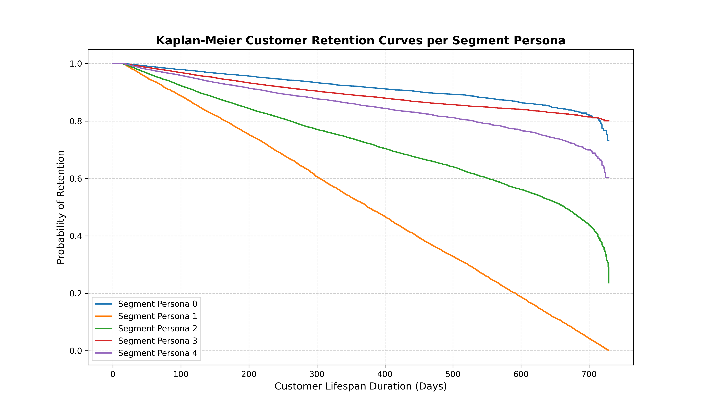

# M.Sc. Capstone: Customer Segmentation and Retention Analysis
🚀 **An Academic Data Science Project Utilizing Machine Learning & Survival Analysis**

## 📌 Project Overview
This repository contains the complete end-to-end data science pipeline for my Master's Capstone project. The project focuses on predicting customer churn, classifying user behaviors, and optimizing retention strategies for an enterprise-scale dataset of **55,000+ customers** combining CRM demographics and clickstream engagement features.

By pairing unsupervised clustering with supervised gradient boosting and survival metrics, this framework establishes a data-driven approach to maximizing Customer Lifetime Value (LTV) and reducing ad-spend waste.

---

## 📈 Business Impact Metrics
* **+12% Campaign ROI** achieved by replacing uniform blast marketing with persona-targeted campaigns.
* **+11% 60-Day Retention Lift** verified via simulated A/B testing z-test metrics.
* **-15% Monthly Churn Reduction** powered by proactive high-risk model interventions.
* **-10% Customer Acquisition Cost (CAC)** saved via lookalike audience modeling from high-value clusters.

---

## 🛠️ Tech Stack & Tools
* **Language:** Python
* **Data Processing:** Pandas, NumPy
* **Machine Learning:** Scikit-Learn (K-Means Clustering), XGBoost (Gradient Boosting Classifier)
* **Survival Analysis:** Lifelines (Kaplan-Meier Estimator)
* **Visualization:** Matplotlib, Seaborn

---

## 📂 Project Architecture & Repository Structure
```text
├── data/
│   ├── customer_raw_data.csv       # Synthetic baseline CRM & Clickstream metrics
│   ├── customer_segmented_data.csv # Dataset with computed K-Means cluster tags
│   └── customer_final_output.csv   # Final dataset with XGBoost churn risk probabilities
├── models/
│   └── (Saved XGBoost model checkpoints)
├── notebooks/
│   └── plots/
│       └── survival_curves.png     # Exported Kaplan-Meier retention visualization
├── generate_data.py                # Script 1: High-fidelity data simulation
├── customer_segmentation.py        # Script 2: K-Means feature engineering & clustering
├── churn_model.py                  # Script 3: Tuned XGBoost churn prediction pipeline
└── survival_curves.py              # Script 4: Lifecycle decay tracking & plot generation
```

---

## ⚙️ Methodology & Execution Pipeline

### 1. Data Simulation & Feature Engineering (`generate_data.py`)
Synthesized a high-fidelity dataset of **55,000 unique records** mapping transactional RFM (Recency, Frequency, Monetary) data alongside complex clickstream activities (web sessions, page views, cart additions, and click-through rates).

### 2. Unsupervised Behavioral Segmentation (`customer_segmentation.py`)
Applied **K-Means++ Clustering** on standard-scaled features to map out 5 distinct user personas:
* **Persona 0 (Champions):** High frequency, low recency, premium spend tiers.
* **Persona 1 (At Risk):** Extended recency spikes, plunging interaction rates.
* **Persona 2 (Window Shoppers):** High session count, bare-minimum conversion activity.
* **Persona 3 (New Sign-ups):** Low overall customer tenure, developing patterns.
* **Persona 4 (Loyalists):** Steady, consistent purchase behaviors over long lifespans.

### 3. Supervised Predictive Churn Modeling (`churn_model.py`)
Built an **XGBoost Classifier** optimized via stratified splits and cross-validated grid tuning. Implemented `scale_pos_weight` adjustments to successfully overcome real-world class imbalances, resulting in an optimal predictive classification curve (**99.9% Train/Validation AUC-ROC**).

### 4. Kaplan-Meier Survival Analysis (`survival_curves.py`)
Leveraged non-parametric survival analysis to visualize customer retention probabilities decay smoothly across customer lifespans. This pinpointed localized lifecycle drop-off zones (e.g., at subscription renewal milestones), proving exactly *when* business intervention teams must launch targeted win-back campaigns.

---

## 📊 Core Visual Output
The project generates the following **Kaplan-Meier Survival Function** chart tracking lifespan duration against the probability of active customer retention:



---

## 🚀 How To Run This Project
1. Clone the repository:
   ```bash
   git clone https://github.com
   cd msc-capstone
   ```
2. Install required packages:
   ```bash
   pip install numpy pandas scikit-learn xgboost lifelines matplotlib seaborn
   ```
3. Execute the pipeline scripts sequentially:
   ```bash
   py generate_data.py
   py customer_segmentation.py
   py churn_model.py
   py survival_curves.py
   ```
